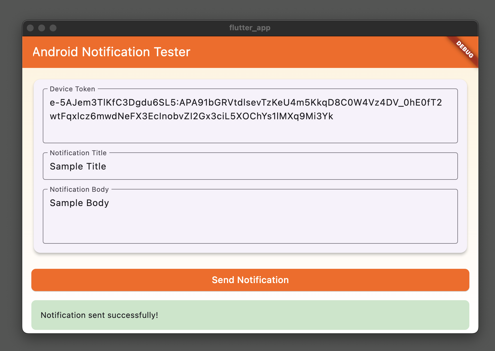

   # FCM Push Notification Tester

A Flutter desktop application with a Node.js backend for testing Firebase Cloud Messaging (FCM) push notifications on Android devices. This tool provides a simple GUI interface to send test notifications using the FCM HTTP v1 API.



## Features

- User-friendly desktop interface for sending push notifications
- Real-time status updates and error handling
- Support for basic notification payload (title and body)
- Uses FCM HTTP v1 API with authentication
- Cross-platform support (macOS, Windows, Linux)

## Prerequisites

Before you begin, ensure you have the following installed:

- Node.js (v14 or higher)
- Flutter SDK (latest stable version)
- Firebase project with FCM enabled
- Service account credentials from Firebase

## Project Structure

```
fcm-push-tester/
├── server/
│   ├── server.js
│   ├── fcm-sender.js
│   └── package.json
├── flutter_app/
│   ├── lib/
│   │   └── main.dart
│   └── pubspec.yaml
└── README.md
```

## Setup Instructions

### 1. Firebase Setup

1. Create a new Firebase project or use an existing one
2. Enable Firebase Cloud Messaging
3. Generate a service account key:
   - Go to Project Settings > Service Accounts
   - Click "Generate New Private Key"
   - Save the JSON file as `service-account.json`

### 2. Server Setup

1. Clone the repository:
   ```bash
   git clone https://github.com/yourusername/fcm-push-tester.git
   cd fcm-push-tester/server
   ```

2. Install dependencies:
   ```bash
   npm install
   ```

3. Place your `service-account.json` file in the server directory

4. Update `fcm-sender.js` with your Firebase project ID:
   ```javascript
   this.projectId = 'your-project-id';
   ```

5. Start the server:
   ```bash
   npm start
   ```

The server will start running on `http://localhost:3000`.

### 3. Flutter App Setup

1. Navigate to the Flutter app directory:
   ```bash
   cd ../flutter_app
   ```

2. Install Flutter dependencies:
   ```bash
   flutter pub get
   ```

3. Run the desktop app:
   ```bash
   flutter run -d macos  # For macOS
   flutter run -d windows  # For Windows
   flutter run -d linux  # For Linux
   ```

## Usage

1. Launch the Flutter desktop application
2. Enter the following information in the app:
   - Device Token: The FCM token from your Android device
   - Notification Title: The title for your push notification
   - Notification Body: The message content
3. Click "Send Notification" to send the test notification
4. Check the status message for the result

## Getting Device Token

To get the FCM device token from your Android app:

1. Implement Firebase Messaging in your Android app
2. Use the following code to retrieve the token:
   ```kotlin
   FirebaseMessaging.getInstance().getToken()
       .addOnCompleteListener { task ->
           if (task.isSuccessful) {
               val token = task.result
               Log.d("FCM Token", token)
           }
       }
   ```

## Troubleshooting

Common issues and solutions:

1. **Server Connection Error**
   - Verify the server is running on port 3000
   - Check if the port is not blocked by firewall

2. **Authentication Failed**
   - Ensure `service-account.json` is properly placed
   - Verify the project ID in `fcm-sender.js`

3. **Invalid Device Token**
   - Make sure the device token is current and valid
   - Check if the target device has the correct app installed

## Contributing

1. Fork the repository
2. Create a feature branch
3. Commit your changes
4. Push to the branch
5. Create a Pull Request

## License

This project is licensed under the MIT License - see the LICENSE file for details.

## Acknowledgments

- Firebase Cloud Messaging
- Flutter Framework
- Express.js

## Support

For issues and feature requests, please create an issue in the GitHub repository.